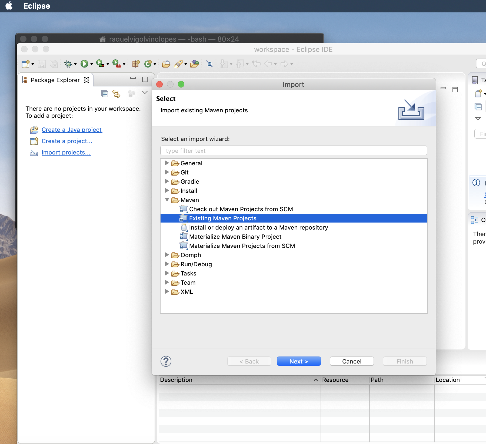

# Criando aplicações Web usando spring boot e eclipse

1. Certifique-se de que tem Java instalado (SDK)
2. Certifique-se de que tem o apache maven instalado (usaremos para gerenciar dependências)
3. Certifique-se de que tem o eclipse (ou outra IDE de sua preferência instalado)

Eu particularmente não acho necessario instalar o pacote spring para o eclipse. A maneira mais fácil (e menos sujeita a erros) de criar um novo projeto de backend Web com spring é usar o starter fornecido pelo spring: [https://start.spring.io/](https://start.spring.io/).

Nesse site vc precisa dar um nome ao pacote do seu projeto, ao projeto em si, escolhar linguagem Java e que o resultado deve estar em um jar. Escolha maven como seu gerenciador de dependências. Em seguida você já pode escolher algumas dependências para o seu projeto. Como vamos escrever **aplicações REST simples** temos sempre que marcar a opção **Spring Web Starter**. 

Thymeleaf deve ser escolhido caso você vá desenvolver backend que retorna páginas HTML. Não será o foco desta disciplina, aqui vamos desenvolver backend como APIs REST que se comunicam usando HTTP e JSON como representação dos dados. Se tiver curiosidade sobre isso verja a [**parte 1** deste exercício](https://docs.google.com/document/d/e/2PACX-1vTZyXSYJKF4mwscYxnbQ3T7ZF3UY2bH4cB0SL6x_g6eZP--mncyf7QuAKzX1kIxMqjvvT8F_PY5wiRu/pub).

JPA deve ser uma dependência marcada quando começarmos a trabalhar com bancos de dados.

Uma vez criado o projeto spring, salve em seu disco. Vai surgir um arquivo zip na pasta de downloads default, faça o unzip antes de continuar. 

Vá no eclipse, Import > Maven > existing maven project. A imagem abaixo ilustra esse import.



Vá clicando em next e informando o que é solicitado. Em _root directory_ informe o caminho do diretório do projeto dezipado e deplois clique em Finish/terminar. Pronto, seu projeto spring já está criado.

Vá clicando em next e informando o que é solicitado. Em _root directory_ informe o caminho do diretório do projeto dezipado e deplois clique em Finish/terminar. Pronto, seu projeto spring já está criado.

[Este exercício](https://docs.google.com/document/d/e/2PACX-1vTZyXSYJKF4mwscYxnbQ3T7ZF3UY2bH4cB0SL6x_g6eZP--mncyf7QuAKzX1kIxMqjvvT8F_PY5wiRu/pub) (**pule para a Parte 2**) mostra o passo a passo de como criar uma API REST. Se tiver interesse em saber como criar uma API que retorna HTML dinamicamente criado veja a parte 1 também. Vá seguindo o passo a passo e tentando entender o que está sendo feito. É preciso que você entenda o significado de certas anotações e saiba usar algumas classes importantes da API do spring.

Conjunto mínimo de anotações que você precisa entender neste momento:
@RestController
@RequestMapping
@PostMapping
@DeleteMapping
@PutMapping
@Service

Busque em tutoriais e especialmente na documentação do spring boot o que cada uma dessas anotações significa e veja exemplos de como são usadas. Uma forma bem bacana de aprender é ir seguindo os [guias do spring boot](https://spring.io/guides). O guia **Building a RESTful Web Service** é bem interessante para este momento e já vai explicar várias dessas anotações acima. 

As respostas de cada método do controlador vai ser uma resposta HTTP. O framework vai montar essa resposta pra você, mas você deve ajudar indicando o conteúdo do JSON a ser retornado e o código de status. Isso é feito usando um objeto da classe ResponseEntity.

A aplicação spring boot é anotada com @SpringBootApplication e já é criada no starter do spring. Essa aplicação deve (pra facilitar) estar em um pacote "pai" de todos os outros, pois é a partir do pacote dessa aplicação que, por default, o spring vai procurar os controladores. Se, por exemplo, seu controlador está no pacote "projsoft.ufcg.controladores", então a aplicação deveria estar no pacote "projsoft.ufcg". Existem formas de fazer diferente e configurar na mão onde estão os controladores, mas por enquanto melhor ir no mais simples.

Para rodar seu projeto abra um terminal, entre no diretório raiz do projeto e execute o comando abaixo:
````
mvn spring-boot:run
````
Se o maven não estiver instalado de forma apropriada você também pode executar com o seguinte comando (que vem no próprio projeto criado no starter do Spring quando você escolhe maven como seu gerenciador de dependências):
````
./mvnw spring-boot:run
````

Você vai precisar criar um controlador Rest que será uma classe marcada com a anotação @RestController, um serviço que será acessado por este controlador. O serviço deve conhecer as regras de negócio para fazer o que foi solicitado, deixando o controlador menos "inteligente", sendo apenas um delegador. Também devem ser criadas classes que chamamos de entidades, são classes Java tradicionais, que irão representar as entidades que serão convertidas para/de arquivos JSON. Essas classes precisam de construtor e de métodos get e set para todos os atributos que devem ir no JSON.
